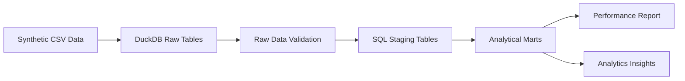
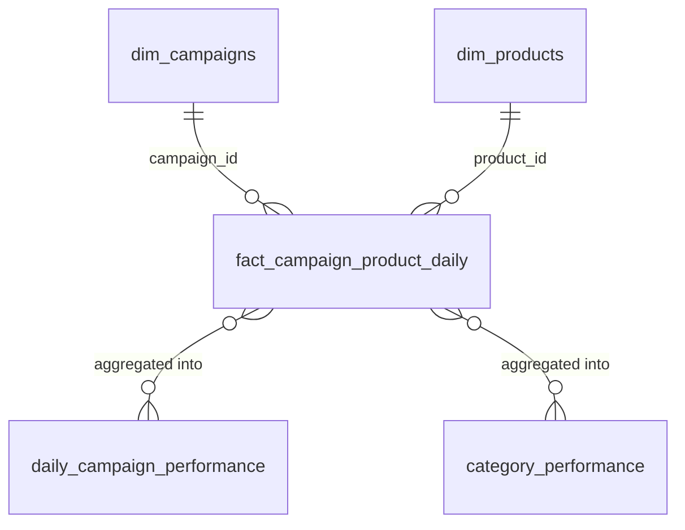

# Advertising Analytics Data Pipeline

[](https://github.com/kat1478/advertising-analytics-pipeline/actions/workflows/ci.yml)

A data engineering portfolio project demonstrating a reproducible, end-to-end advertising analytics pipeline.
The project addresses the business problem of analysing advertising campaign performance, tracking spending, and evaluating return on ad spend (ROAS).
It uses a synthetic advertising dataset and mimics an analytical warehouse workflow entirely with local tools.

## Project Overview

The project implements an end-to-end analytical workflow:

synthetic data → raw ingestion → data quality validation → SQL staging → analytical marts → metric quality tests → Markdown report → rule-based business insights

## Business Questions

This pipeline is designed to answer core business questions:
- Which campaigns generate the highest ROAS?
- Which campaigns attract clicks but fail to convert?
- Which product categories generate the most revenue?
- Which campaigns have high acquisition costs?
- Can downstream reports trust the underlying data?

## Architecture



- **Python**: Responsible for data generation, extraction, pipeline orchestration, reporting, and insight generation.
- **SQL**: Responsible for staging and analytical data modeling.
- **DuckDB**: Serves as the local analytical storage.
- **pytest**: Enforces rigorous validation on raw data and final metric outputs.

## Data Model

The pipeline transforms data through several layers:

**Raw Layer:**
- `raw_campaigns`
- `raw_products`
- `raw_impressions`
- `raw_clicks`
- `raw_costs`
- `raw_conversions`

**Staging Layer:**
- `stg_campaigns`
- `stg_products`
- `stg_impressions`
- `stg_clicks`
- `stg_costs`
- `stg_conversions`

**Marts Layer:**
- `dim_campaigns`
- `dim_products`
- `fact_campaign_product_daily` *(grain: event_date × campaign_id × product_id)*
- `daily_campaign_performance`
- `category_performance`



## Advertising Metrics

The pipeline calculates key performance indicators natively (all monetary values in **PLN**):
- **CTR (Click-Through Rate)**
- **CPC (Cost Per Click)**
- **Conversion Rate**
- **ROAS (Return on Ad Spend)**
- **Cost per Conversion**

For detailed definitions, formulas, ROAS interpretation ranges, and metric assumptions, see [docs/METRICS.md](docs/METRICS.md).

## Data Quality

The project implements an extensive automated `pytest` suite enforcing data quality constraints:
- required tables exist
- null primary keys are prevented
- duplicate identifiers are rejected
- foreign-key relationships are maintained
- financial metrics are strictly non-negative
- funnel consistency is logically bounded
- metric ranges (e.g. CTR between 0 and 1)
- allocated cost reconciliation against source data
- safe division to prevent zero-division errors

## Attribution Model

The pipeline relies on **impression-based attribution**. 
- Clicks and conversions are connected back to the originating impression.
- Downstream events are assigned to the impression cohort date.
- This preserves daily funnel consistency (impressions >= clicks >= conversions).

Note: This is not the only valid industry attribution model, but it is a deliberate analytical choice for this project to maintain strict funnel cohort alignment.

## Project Structure

```text
.
├── docs/
│   ├── ARCHITECTURE.md
│   ├── METRICS.md
│   ├── PROJECT_CHARTER.md
│   ├── REPORTING.md
│   └── ROADMAP.md
├── reports/
│   ├── analytics_insights.md
│   └── campaign_report.md
├── sql/
│   ├── marts/
│   └── staging/
├── src/
│   ├── analytics_assistant.py
│   ├── config.py
│   ├── generate_data.py
│   ├── generate_report.py
│   ├── load_raw.py
│   ├── paths.py
│   ├── run_pipeline.py
│   ├── run_sql.py
│   └── validate_data.py
├── tests/
│   ├── test_analytics_assistant.py
│   ├── test_generate_report.py
│   ├── test_marts_sql.py
│   ├── test_metrics_quality.py
│   └── test_staging_sql.py
├── environment.yml
└── pyproject.toml
```

## Getting Started

This project uses `mamba` to ensure consistent dependency management.

1. **Create the environment:**
   ```bash
   mamba env create -f environment.yml
   ```
2. **Activate the environment:**
   ```bash
   mamba activate ads-analytics-pipeline
   ```

### Quick start (one command)

Run the full pipeline with a single command:

```bash
python -m src.run_pipeline
```

This executes all seven steps in order — synthetic data generation, raw loading, validation, staging, marts, Markdown report, and analytics insights — and verifies all outputs before completing.

### Manual execution (individual steps)

Each step can also be run individually in sequence:

```bash
python -m src.generate_data       # 1. Synthetic data
python -m src.load_raw            # 2. DuckDB raw ingestion
python -m src.validate_data       # 3. Raw data validation
python -m src.run_sql             # 4. Staging + marts SQL
python -m src.generate_report     # 5. Markdown report
python -m src.analytics_assistant # 6. Business insights
```

## Testing

Run the full test suite:
```bash
python -m pytest -q
```

The tests cover:
- data generation (determinism, ROAS plausibility)
- raw ingestion
- raw data validation
- SQL staging
- analytical marts
- metric quality and bounds
- Markdown report generation
- analytics insights (one-per-campaign, PLN currency)
- end-to-end pipeline orchestration (full run, determinism, failure propagation)

## Continuous Integration

GitHub Actions runs on every pull request and push to `develop` or `master`.

- **tests job**: `python -m compileall src tests scripts` + `python -m pytest -q`
- **end-to-end job** (runs after tests pass): `python -m src.run_pipeline`, output verification, and a `git diff --exit-code` check confirming that committed sample report artifacts match the pipeline output.

See [docs/CI.md](docs/CI.md) for details.

## Example Outputs

The pipeline automatically generates formatted markdown outputs showcasing the final metrics:
- [Performance Report](reports/campaign_report.md)
- [Analytics Insights](reports/analytics_insights.md)

## Key Engineering Decisions

- **DuckDB** as a fast, file-based local analytical warehouse.
- **SQL-first** transformations to mimic dbt-like workflows.
- **Python** for orchestration, data manipulation, and testing.
- **Deterministic synthetic data** ensuring reproducibility without privacy risks.
- **Layered architecture** cleanly separating raw, staging, and marts layers.
- **Rule-based analytics assistant** to translate mathematical metrics into actions without requiring external LLM API keys.
- **Automated quality tests** protecting analytical outputs from regression.

## What This Project Demonstrates

This repository is built to showcase standard competencies:
- Data pipeline design
- Analytical data modeling
- SQL transformations
- Data quality engineering
- Metric definition and testing
- Reproducibility
- Business-oriented reporting
- Git and pull-request workflow

## Limitations

- Synthetic rather than real production data
- Local DuckDB rather than a cloud warehouse
- Batch rather than streaming processing
- Rule-based assistant rather than an LLM
- Simplified attribution model
- No production deployment yet

## Roadmap

Completed:
- Deterministic synthetic data generation
- DuckDB raw ingestion and validation
- SQL staging and analytical marts
- Advertising metric quality tests
- Markdown performance report
- Rule-based analytics assistant (PLN, classified insights)
- End-to-end pipeline orchestrator
- GitHub Actions CI (tests + end-to-end smoke test)

Planned:
- Prefect orchestration
- Streamlit dashboard
- Optional Ollama integration
- BigQuery-compatible SQL
- Cloud deployment
